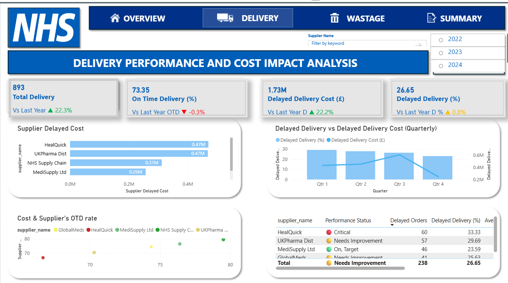
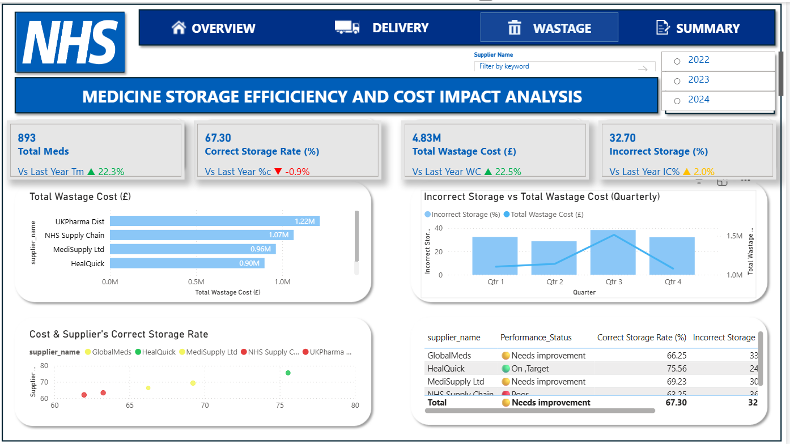
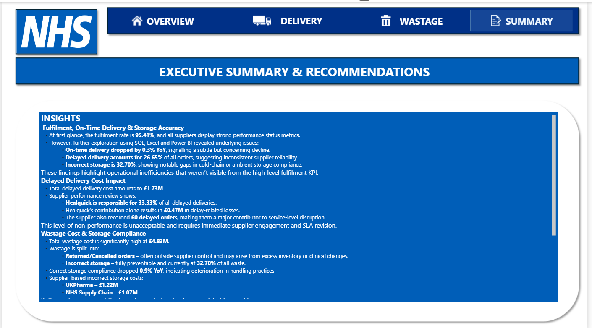

# 📦 NHS Pharma Supply Chain & Logistics Performance Dashboard  
### Power BI | SQL | Power Query | DAX | Data Storytelling | Procurement Analytics

---

## 📌 **Project Description**

This project presents an end-to-end **interactive Supply Chain & Logistics Analytics Dashboard** for NHS Pharma suppliers.  
It analyses **order fulfilment, delivery reliability, storage compliance, cost impact, and supplier performance**, enabling Supply Chain, Procurement, and Operations teams to make informed, data-driven decisions.

The report consists of **four dashboards**:

1. **Order Fulfilment & Delivery Efficiency Overview**  
2. **Delayed Delivery Cost Impact & Supplier Breakdown**  
3. **Wastage Cost & Storage Compliance Analysis**  
4. **Summary & Strategic Recommendations**

This project demonstrates capabilities in **ETL, data cleaning, modelling, KPI development, root-cause analysis, procurement insight generation, and professional BI report design**.

---

## 🧩 **Problem Statement**

The NHS pharma supply chain handles thousands of orders across multiple suppliers, but leadership lacked:

- A **centralised view** of supplier fulfilment and delivery performance  
- Visibility into the **financial impact of delays**  
- Insight into **wastage drivers and poor storage compliance**  
- A clear understanding of **which suppliers contribute most to inefficiencies**  
- A structured summary to support **SLA negotiation and supplier performance management**

This dashboard solves these problems by integrating multiple datasets, transforming them, and presenting **clear, actionable performance intelligence**.

---

## 🏥 **Business Context**

Efficient delivery and correct product storage are critical to NHS operations because delays or incorrect handling:

- Affect patient care  
- Disrupt pharmacy workflows  
- Increase operational costs  
- Reduce supply chain reliability  
- Generate avoidable waste  

This dashboard was built to support:  
- **Procurement category reviews**  
- **Supplier performance meetings**  
- **SLA revisions**  
- **Quarterly business reviews (QBRs)**  
- **Cost-saving and waste-reduction initiatives**

---

## 🗂️ **Folder Structure**

/NHS-SupplyChain-Logistics-Dashboard
│
├── README.md
│
├── Data/
│ ├── raw/ → uncleaned CSV files
│ ├── cleaned/ → post-Power Query cleaned files
│
├── PowerBI/
│ ├── NHS_SupplyChain.pbix
│
├── Documentation/
│ ├── data_dictionary.md
│ ├── transformation_steps.md
│ ├── dax_measures.md
│
└── Screenshots/
├── dashboard1.png
├── dashboard2.png
├── dashboard3.png
├── dashboard4.png

Upload your files into these folders when building your GitHub repo.

---

## 📥 **Dataset & ETL Overview**

### **Data Sources**
- CSV extracts from NHS pharma order systems  
- Excel files for additional cleaning  
- SQL used for exploratory analysis and validation  

### **ETL Process (End-to-End)**  
1. **Extraction**  
   - Imported CSV files into Power BI using Power Query  
   - Validated raw data in SQL (NULL checks, duplicates, datatypes)

2. **Transformation (Power Query)**  
   - Removed duplicates  
   - Standardised date formats  
   - Fixed inconsistent supplier names  
   - Created calculated columns (delivery status, storage accuracy)  
   - Handled missing or invalid values  
   - Ensured correct data types

3. **Loading**  
   - Loaded the transformed tables into Power BI Model  
   - Built relationships and star-schema style modelling  

This satisfies ETL/ELT requirements expected in professional analytics roles.

---

## 🛠️ **Data Cleaning & Transformation (Details)**

See `/Documentation/transformation_steps.md` for full steps, but summary:

### **Power Query Tasks**
- Trim & clean supplier names  
- Split delivery timestamp into date & time  
- Create flags:
  - On-Time / Late  
  - Correct / Incorrect Storage  
- Remove unused columns  
- Merge lookup tables  
- Create parameterised queries for reusability  

### **SQL Checks Used**
```sql
SELECT supplier_name, COUNT(*) 
FROM orders
GROUP BY supplier_name;

SELECT *
FROM orders
WHERE delivery_date IS NULL;
## 📥 **Dataset & ETL Overview**

### **Data Sources**
- CSV extracts from NHS pharma order systems  
- Excel files for additional cleaning  
- SQL used for exploratory analysis and validation  

### **ETL Process (End-to-End)**  
1. **Extraction**  
   - Imported CSV files into Power BI using Power Query  
   - Validated raw data in SQL (NULL checks, duplicates, datatypes)

2. **Transformation (Power Query)**  
   - Removed duplicates  
   - Standardised date formats  
   - Fixed inconsistent supplier names  
   - Created calculated columns (delivery status, storage accuracy)  
   - Handled missing or invalid values  
   - Ensured correct data types

3. **Loading**  
   - Loaded the transformed tables into Power BI Model  
   - Built relationships and star-schema style modelling  

This satisfies ETL/ELT requirements expected in professional analytics roles.

---

## 🛠️ **Data Cleaning & Transformation (Details)**

See `/Documentation/transformation_steps.md` for full steps, but summary:

### **Power Query Tasks**
- Trim & clean supplier names  
- Split delivery timestamp into date & time  
- Create flags:
  - On-Time / Late  
  - Correct / Incorrect Storage  
- Remove unused columns  
- Merge lookup tables  
- Create parameterised queries for reusability  

### **SQL Checks Used**
```sql
SELECT supplier_name, COUNT(*) 
FROM orders
GROUP BY supplier_name;

SELECT *
FROM orders
WHERE delivery_date IS NULL;
Excel Checks
VLOOKUP validation

Pivot exploration

Missing value comparisons

📐 DAX Measures Used
See full list in /Documentation/dax_measures.md.

Key measures include:

DAX
Fulfilment Rate = DIVIDE([Completed Orders], [Total Orders])

On Time Delivery % = DIVIDE([On Time Orders], [Total Orders])

Delayed Delivery % = DIVIDE([Delayed Orders], [Total Orders])

Incorrect Storage % = DIVIDE([Incorrect Storage], [Total Orders])

Total Delay Cost = SUM(Orders[Delayed_Cost])

Total Waste Cost = SUM(Orders[Wastage_Cost])

## 📊 Dashboard 1 – Fulfilment Overview


## 📊 Dashboard 2 – Delayed Delivery Cost Impact


## 📊 Dashboard 3 – Storage Compliance & Wastage Cost


## 📊 Dashboard 4 – Summary & Recommendations


